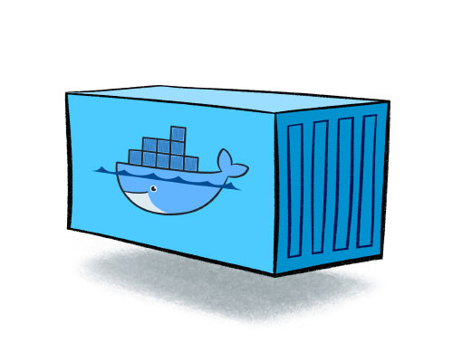

## Hola Mundo  
### Welcome to My kubernetes Jouney

I am a DevOps engineer at Fiftyfivetech.<br />
I will share deep dive knowledge of kubernetes which I learned from various sources.<br />
I will include the sources i used to learn in the references page.<br />
I am assuming the reader have some knowledge of Docker.<br />
Familiar with Contanirezed technology and Images.<br />
Bonus :- We will automate the Azure kubernetes service with terraform.<br />

### Let's start contanirezed app deployment in real world.

What happens in the real time scenerio is a developer writes a code attach a docker file.<br />
Build a image and deploy it to anywhere where the docker is installed such as
1. DE[ Docker Engine ] running in a server. 
2. DE[ Docker Engine ] running in a Pc.
3. DE[ Docker Engine ] running in a cloud.

Things which are needed to be taken care of 
1. Downtime 
2. Security
3. Upgrade 
4. Portability 
5. Migration
6. Auto Scaling

this is a huge bucket of lists I am showing some points on super fast deployment.<br />
Deployment must not be complex<br />

So let's assume a person deploy a ec2-instance on AWS cloud installed docker[remote server] and run the dockerfile on the ec2instance let this be our scenario.<br />
**Now the important question is which one is hard to achieve from the list mentioned**

So the un-achieveable task in the above list is **Downtime** .<br />
In any chance if the server goes down or any bug or it gets shut off by any reason so docker engine will be stopped and we cannot access the website.
We can have 2 instances or 3 or 4 so we are installing docker engine everywhere . So I am a docker engineer a developer gives me a application I created a container and delpoyed.Written a script if one of my server gets down my script is gonna connect to other server.
Let's assume we have 10,000 docker images and we have to setup these 10,000 images in the server and we are gonna host so many servers and its get hard to images . we can use ansible but its also a little headache to manage even one of my containers gets down and the whole infrastructure gets messed up.

**We need something which can automatically solves the problem**
So here we need something which can manage our container this is called *Container Orchestration*.<br />
We need some tools which can perform container orchestration.
Lets discuss some 
1. Docker Swarm 
2. Dokku
3. Apache Mesos 
4. Kubernets

The most powerfull, popular, amazing is **Kubernetes**.<br />
Its a technology we are gonna love. <br />
Its also known as K8s because it have 8 characters in between.<br />
Its a next generation container orchestration engine. <br />

k8s is originally designed by google.<br />
Entire kubernetes is written in Go language.<br />
and released in 2014.<br />
CNCF is maintaining kuubernetes these days. <br />
A project managed by Cloud Native Computing Foundation.<br />

### we have to understand how kubernets solve our ploblems we were facing earlier 
So we need to have a look on Kubernetes Architecture.<br />
It can be deployed anywhere.<br />
Kubernetes also workes on master-slave model.<br />
Lets assume a scenario where we have one linux based machine connected to multiple machine and a windows server 2019 based machine.<br />
These machines are connected with a switch.<br />
Now the linux machine is called master in the above cluster.<br />
The rest machines is called Minions or worker.<br/>

To deploy kubernets you need to install Docker engine in all the machines.<br />
**So why we need to install docker in all the systems present**<br />
Because Kubernetes can not create containers. Kubernetes is not for creating containers.
Its for managing containers thats why we called it container orchestrtaion.
Containers is still created by docker not only docker you can use multiple tools to create containers.<br />such as
1. Docker 
2. Pod-Man
3. Cri-o
4. Containerd

Kubernetes is for managing conatainer, autoscaling and we will discover more.<br />
Each and everything we dicussed in the above list is provided by kubernetes.<br />

So we need to understand the architecture of k8s.<br />
In that architecture where we have one master and 3 minion and its connected with a switch and docker engine is running in all the systems.<br />
k8s is collection of so many products.<br />
So the important component in Master system is Kube-ApiServer.<br />
The list of achievement we want earlier is not just beacuse of master-minion structure<br />
kubernetes nodes has so many components.<br />
Componets are responsible for achieveing the earlier list.<br />

So lets assume a kubernetes administrator and developer both are the client of kubernetes.<br />
How are we going to access the kubernetes cluster ??<br />
The answer is we are going to connect the kubernets with TCP socket.<br />
To access your kubernets cluster we can connect to api server kubernets api server so that is kind of endpoint( it means we can connect to kubeApiserver ).<br />
So lets assume i have a docker image and i want to deploy it to k8s so I dont need to access the minions I can directly communicate with the kubeApiserver and say I want to deploy a image.<br />
So if you want to delete launch or do anything you have to connect to the kubeApiserver running on master-node.<br />

Another component present in master node is KubeScheduler.
As a developer or administrator i request kubeApiserver to deploy my image in k8s cluster.Which will be recieved by kubeApiserver. **We need to understand kubeApiserver is not going to deploy the images in the master node**.Its just a management node.So in any of the minion this image is going to deployed so this decision is taken care by kube schedlar.So it will find the right minion node and schedule in any of the minion node.
**But how its going to get which node is healthy to deploy the container**

Now here comes a component which is present in master node is *Node controller*.<br />
So its check's the minion node and if no minion is in better condion it will add one for you.
To remove a unhealthy minion node is also done by node controller.<br />
The node controller is responsible for the maintaince of minions.

Another component we have to look on is Replication Controller.

It's something present in master that will make sure number of container availability in worker nodes.<br />
so as a developer we need to deploy 2 conatiner in the cluster and its get scheduled in muliple minions .
suppose We have 3 minions in our cluster and its gets scheduled in minion 1 and minon 3.Now for some reasons my minion 3 goes but we have a requirement of 2 containers so Replication controller will connect to the kubeScheduler and assign it in somewhere else which is healthy.<br /> 
So in simple terms the Replication controller is responsible for container counts so anytime we have lack of container . The component will automatically create a container.

By Combing the components running in master such as KubeApi server,Kube Scheduler,Node Controller, Replication controller in a single entity and calling this single entity as *Control Plane*.

**So rather than calling them individually by there name we can call it by Control Plane component**
**Control Plane is the official keyword by kubernetes** 

### So lets revise major components in Kubernetes 

- kubeApi Server
- Kube Scheduler
   Kube scheduler schedules the minion.
- Node Controller 
   It takes the responsibility to check the minion health it can add a minion to the kubernetes cluster 
- Replication Controller 
   Maintaining the container count .

- Control Plane 
   KubeApi server,Kube Scheduler,Node Controller, Replication controller these components are togther called control pane.

## Now the question is ??
**How Kubernetes will remember the status of cluster or application ???**
If we have a cluster of 3 minion and multiple container is running.
The 1 minion is consumed more than 50% and 1000 container's are running. <br />
The 2nd minion is consumed more than 25% and 400 container's are running<br />
The 3rd minion is only 10% consumed and 500 containers are running.which containers are up and running and which are not working/down and if one minon goes down how it can migrate to another minion<br />
So whatever is happening inside cluster each and every detailed information needs to be stored persistently.<br />
In the master itself there is Database server we call it `ETCD`.
The status of cluster or application will be stored in `ETCD`.
Every single thing is saved in `ETCD`.Its a pure no sql Database.
Stores value in Key:value pair.
It also runs in the master Node.

Its the most important componet on Kubernets.<br />
We can call it the brain of kubernetes.<br />

ETCD is not counted in the Control plane because its optional to have it on master server we can deploy it to another server and tell kubeapiserver to read and write the data in that server.

[Link](url) and 

So as a k8s Administrator or engineer its impossible to manage each and every services. 
**there is a service in K8s master we call it Kubelet**<br />

### Kubelet 
It can manage all the componets of k8s master.

**These are the most important componet we need to learn**

### Networking in k8s
The cluster we have of 3 minion and we installed docker engine and we know a bridge called docker0 will be coming to each and every node and the IP will be same. So on the cluster all the minions running containers are going to get same IP assigned by docker0 It can show the same IP assignment.

**So k8s doesn't use docker bridge, so how k8s are going to communicate ?**

We will create a common bridge lets say <yourNameBridgeNetwork>  which will be connection to all the resources.
Create container any where the ip will be assigned from <yourNameBridgeNetwork> bridge Network only and master will also use that bridge only
**So who is going to create that bridge for us**
In present market there are so many networks which can help us creating bridge.<br />
Such as<br />
1. Flannel 
2. Callium 
3. Cisco ASI 
4. Weave-net 
5. calico 

You can use any one to create this bridge.I am going to use calico. 

## Kube-Proxy.
So in the cluster we setup KubeApi server and many components.
Now my components can communicate with each other. 
Now I want a my containers scheduled in multiple minions to communicate each other.
My container-3 can communicate to container-2 but container-2 cannot communicate to Container-1.


Kube-Proxy will maintain the communication between the containers accross the worker nodes.

### Types of Installation.
1. Single node k8s cluster 

If you have minikube and configure custer than VM ware , Virtual box.
The coolest part is you can setup a container and that container will setup the minikube cluster inside the container 
**So you can image a tool to manage container can be run inside a container and inside the container it will manage your container and interact with the docker engine**
Inside a container another container is running which triggers a kubernetes cluster 

Command you require to run a container engine of minikube you can exectue the following command 

```bash
minikube start --driver=<driver_name> # here the driver name you have to specify vmbox or docker.
# If you want to use docker so you can run it with 
minikube start --driver=docker
# To take the shell of the docker container 
docker exec -it minikube bash 
```
No Minikube is running in your local system and you can access the nodes which are running in your local environment by 

```bash
kubectl get nodes # The output will look like this 
# NAME       STATUS   ROLES    AGE   VERSION
# minikube   Ready    master   21h   v1.18.3
```
2. Multi Node k8s cluster
    2.a) 1 Master N-Minion 
    2.b) Multi Master N-minion

3. Kubernetes as a service / Cloud provider 
    1. EKS
    2. AKS
\n If you want to connect to any file on the remote location you can always use the command 

```bash
kubectl get nodes --kubeconfig <fileName>.conf
# In windows you have to specify the complete path of the file
```


### Pods 
The containers are encapsulated known as pods. We can say like pod is a wrapper over container 
Short story which might help us to understand better :- \n
Think of a big shop which produces a good quality of clothes such as shirts,pants a local vendor purchase those products and sell it on local market . Good reputed firms such as Zara ,US polo also purchase those products a little touch/change is added and tag is attached now its a Quality product 
We can think Pod as a zara product which makes it more cool and awesome.
``` bash
kubectl run nginx -image nginx
kubectl get pods 
# To check the network assigned to the pods 
kubectl get pods -o wide 
# To get more data about the pods 
kubectl describe pod < Pod Name >
```
### How to create pods in Kubernetes.
There are two methods to create Pods in Kubernetes 
1. YAML 
2. JSON

Basically we have to remember 4 major points to before creating a Yaml file 
1. apiVersion 
2. kind
3. Metadata
4. specification 


**A sample Pod file** 
```bash
apiVersion: v1
kind: Pod #Here P is Capital
metadata: # Some information about the pod  
  name: <YourName>pod # This is my pod name like container name in docker containers
spec:
  containers: # About my docker images and Containers info 
    - image: nginx # This is the data of the image which will be pulled from the hub.docker.io
      name: <YourName>pod # The Name if the container will be suraj pod ** You don't need unique name 
      ports:
        - containerPort: 80 # same as expose port in docker file
```

**The command to launch the pods**
```bash 
kubectl create -f <podFileName>.yml
```

### Working in Kubernetes 

The basic flow in which a pod is deployed in kubernetes.

1. Create a YML or JSON file run from kubectl command.
2. It goes to kubeApiServer. It takes the request to scheduler.
3. Kube-scheduler will send this to kubelet. 
4. kubelet takes request over minions.
5. Kubelet will write the information and inform Kubeapi server that its running pod scheduled. 
6. KubeApiServer will write this information to database in `etcd` .
7. etcd stores the data about how much resources are used in pod and all information regarding pod.

## Best practice to write a pod file.

1. Create a manual pod file which is by opening editor and  write the yaml. 

Important terms to remember is **always prefer ports keywords and container port**
Commands to run the kubernetes cluster 

```bash 
kubectl get pods # To get the pods details 
kubectl create -f <podfile>.yml # to create the pod from yaml file 
# You can also update the pod but only certain fields can be changed not each fields can be updated
kubectl apply <podName>
# To delete the Pod 
kubectl delete pod <podName>
# To delete all the Pods 
kubectl delete pod --all
# To recreate 
kubectl create -f <podfile>.yml
```
**How we can check detailed information about pods**
```bash 
kubectl describe pods <podName>
```
#### How we can write a pod file without remembring it ??

```bash 
# We can get the details about the Pod file using 
kubectl explain pods | less # it will take you to page 1 and display all the commands 
# To get the details about the specific componets of pod file.
kubectl explain pods.apiversion | less
# To get the details about the Kind component of pod file 
kubectl explain pods.kind | less
# To get the  details about the spec component of pod file 
kubectl explain pods.spec | less
# To get specific components details .
kubeclt explain pods.spec.containers.ports | less
```
## Another best method to Auto generate pod file.

**We can use kubectl command to generate the Pod file** 
```bash 
kubectl run <podName> --image=nginx --port 80 --dry-run -o yaml 
# the --dry-run here will not create a pod but simply checks the syntax 
# Redirect it to some file so we can use it later 
kubectl run <podName> --image=nginx --restart Never --dry-run -o yaml > wow.yaml
# It will create a file with the name wow.yaml . 
# If you want to generate the json you can change the -o json   
# --restart is a policy used 
```

**Key takeaways till here**
1. Manage pod communication across worker node . 
2. Kubernetes client - kubectl .
3. Path token config file in kubernetes is `/etc/kubernetes/admin.conf` .
4. `Kubectl get ns` It willl give you list of all the namespacecs. 
5. To check the labels in the pods kubectl get pods --show-labels.
6. To take help about the apiVersion `kubectl explain <resourceType>`    

Some commands to interact with minikube 
<script src="https://gist.github.com/Imsurajkr/2540dd6ca5597686981b6397383bc760.js"></script>

## So Pod can be created by 5 ways 
1. YAML
2. Command Line 
3. JSON 
4. API
5. Programming 

## Here arises a question how to access your application running in a pod ?

Let's Assume  are working in a project and they have to setup a cluster of kubernetes 

### Support or Contact

Have any doubt regariding the docs please Mail [surajkumar.devp@gmail.com](#).
New updates Coming soon
Go to the next page[here](./new-page.html)